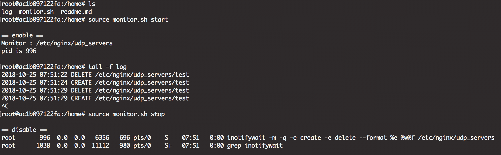

# Synopsis
- env : ubuntu:16.04
- This script use `inotifywait` to monitor folder, `https://linux.die.net/man/1/inotifywait`
- This script could help you to handle `在指定的資料夾中，監控資料夾的變動，並執行某些動作`


# Usage



- 確定 ubuntu 已安裝 inotifywait : `apt-get install inotify-tools -y`
- 設定環境變數 `MONITOR_FOLDER`, 預設是 `/tmp`, 請查看 monitor.sh
- 變更要執行的動作在 `actionJob()`
	- 預設的行為 [當資料夾有異動, 寫入 log] (log 可透過 logrotate 進行 backlog & rotate, 參考下方)
- 預設控制的事件是 `create` 與 `delete`, 其他控制事件請參考備註
- Usage : `source monitor.sh --help`


# 使用測試
> 快速使用可用 `docker build -t foo . && docker run --rm -it -v $(pwd):/home --workdir /home foo /bin/bash` 建立環境

1. 環境設定好
2. 執行 `source monitor.sh start`
3. 因預設的監控資料夾為 `/tmp`, 故 `echo "" > /tmp/test`, 執行第一次後, 產生 log
4. `cat /home/log`
5. `rm /tmp/test`, then `cat /home/log`


# Remark : 關於 log rotate

- 避免 log 無限制地成長, 可使用 logrotate 進行循環, `apt-get install -y logrotate`
- 快速使用說明 : https://jhaoheng.github.io/blogpost/ubuntu/log/logrotate/#read-more

> 範例 config, 確定 log 的位置
```
/tmp/log {
	size 1k
	create 700 root root
	rotate 4
}
```


# Remark : 事件

```
access		file or directory contents were read
modify		file or directory contents were written
attrib		file or directory attributes changed
close_write	file or directory closed, after being opened in
           	writable mode
close_nowrite	file or directory closed, after being opened in
           	read-only mode
close		file or directory closed, regardless of read/write mode
open		file or directory opened
moved_to	file or directory moved to watched directory
moved_from	file or directory moved from watched directory
move		file or directory moved to or from watched directory
create		file or directory created within watched directory
delete		file or directory deleted within watched directory
delete_self	file or directory was deleted
unmount		file system containing file or directory unmounted
```